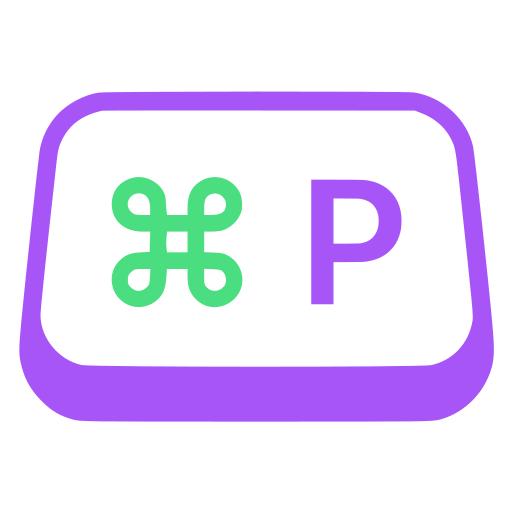

<!--
SPDX-FileCopyrightText: 2026 Maik-0000FF
SPDX-License-Identifier: GPL-3.0-or-later
-->

# bindpeek | Shortcut cheat sheet for the running Wayland session

<p align="center"></p>

[](https://www.gnu.org/licenses/gpl-3.0)
[](https://github.com/Maik-0000FF/bindpeek/actions/workflows/ci.yml)
[](#nix--nixos)


[](https://github.com/sponsors/Maik-0000FF)
[](https://ko-fi.com/maik0000ff)

**Hold a modifier, see what it does.** bindpeek reads the shortcuts your
compositor is actually configured with and shows them while you hold the keys,
without taking the keyboard away from you.

Nobody remembers every combination they once bound. The usual answer is to open
the configuration file in a second window and read it, which is the one thing
you cannot do while holding the keys you are asking about. bindpeek puts the
list on screen instead, for exactly as long as the modifier is down, and the
shortcut still fires when you complete it.

**Features:**

- Reads the shortcuts of the running session: **mango**, **Hyprland** and
  **KDE Plasma**, each from the file or service that session really uses
- Appears while a modifier is held and goes when it is released, after a delay
  you set
- Never takes the focus and never eats a key: the panel is a bystander, so the
  combination you are looking at still works
- Narrows the list as you add modifiers, and shows what a further modifier
  would reach in one of four ways
- Reads the source again before every appearance, so an edited configuration is
  live without restarting anything
- Fourteen palettes, or follow the desktop's light/dark setting; position,
  distances, font, corners, border and transparency all settable
- A settings window with a live preview of the real panel, and a tray icon that
  switches the panel on and off
- Prints the same list as plain text in the terminal: `bindpeek --list`
- German and English

> [!NOTE]
> The panel is a `wlr-layer-shell` surface, which is what lets it float above
> everything without taking the focus. Every wlroots-based compositor carries
> that protocol, and so do Hyprland, KWin and niri, but **not GNOME/Mutter**
> and not X11. On a session without it, bindpeek says so and stops instead of
> coming up as an ordinary window. `--list` works anywhere.

## Documentation

- **[Quick Start](#quick-start)**
- **[Usage](#usage)**
- **[How It Works](docs/HOW-IT-WORKS.md)**
- **[Installation](docs/INSTALLATION.md)**
- **[Configuration](docs/CONFIGURATION.md)**
- **[Architecture](docs/ARCHITECTURE.md)**
- **[Troubleshooting](docs/TROUBLESHOOTING.md)**

## Quick Start

### Arch · Debian/Ubuntu · Linux Mint · Fedora · openSUSE

```bash
git clone https://github.com/Maik-0000FF/bindpeek.git
cd bindpeek
./install.sh
```

The script names what is missing before it installs anything, builds, and then
asks two questions separately, because both give away more than an installation
normally does: whether to add you to the `input` group, and whether to start the
tray with your session. Log out and back in afterwards if the group was added.

### Nix / NixOS

```nix
# flake inputs
bindpeek.url = "github:Maik-0000FF/bindpeek";

# NixOS configuration
imports = [ inputs.bindpeek.nixosModules.default ];
programs.bindpeek = {
  enable = true;
  # Both are off by default because both widen what the machine allows:
  inputAccessFor = [ "alice" ];   # read access to the keyboard
  autoStart = true;               # tray in every graphical session
};
```

`autoStart` writes the desktop entry into `/etc/xdg/autostart`, which only a
desktop environment reads. Under a compositor started from a script, put a line
in its own startup file instead:

```bash
bindpeek-editor &
```

## Usage

Start the tray icon and the settings window:

```bash
bindpeek-editor
```

The panel comes up with it. Hold a modifier, and the shortcuts that modifier
fires appear. Add a second modifier and the list narrows to what the two of them
fire together. Release, and it is gone.

The same list as text in the terminal:

```bash
bindpeek --list
```

This is also the quickest way to see what bindpeek reads out of your
configuration, and it is what still works on a session that cannot show the
panel.

Other options:

| Option | What it does |
| --- | --- |
| `--list` | Print the shortcuts instead of showing the panel |
| `--keys` | Print the held modifiers as they change, to check that the event devices can be read |
| `--environment mango\|hyprland\|kde` | Force the session instead of detecting it |
| `--source <path>` | Read the shortcuts from this file instead of the session's own |
| `--help`, `--version` | The usual |

Everything else is set in the settings window, or by editing
`~/.config/bindpeek/bindpeek.conf`, which the program writes on first start with
a comment above every line. Both are read live. See
**[Configuration](docs/CONFIGURATION.md)**.

## Requirements

- A Wayland session whose compositor implements `wlr-layer-shell`. Every
  wlroots-based one does, which is mango, Sway, river and their like, and so do
  Hyprland, KWin and niri, which are each built on something of their own and
  carry the protocol anyway. GNOME/Mutter and X11 cannot show the panel.
- Membership in the `input` group. The panel appears while a modifier is held,
  and a Wayland program is told nothing about a key until it has the focus,
  which the panel deliberately never takes. The modifiers are therefore read
  from the event devices below the compositor, and that is what the group
  grants. See **[How It Works](docs/HOW-IT-WORKS.md)** for what it means.
- Qt 6, layer-shell-qt, libevdev and KDE's KConfig framework. `install.sh`
  installs them for you, and shows every package by name before it does. What
  that comes to on your distribution:
  [What gets installed](docs/INSTALLATION.md#what-gets-installed).

Reading the shortcuts themselves is a second question, and there the answer is
narrower: mango, Hyprland or KDE Plasma. On any other compositor the panel can
be drawn but there is nothing yet to fill it with, and bindpeek says which
session it found rather than guessing.

## Uninstallation

```bash
./uninstall.sh
```

It removes the programs, the desktop entry and its icon, and asks before it
touches your settings. The packages it installed to build with are left alone.

## Feedback

Something not working, or a session you would like supported? Open an issue with
the output of `bindpeek --list` and your compositor's configuration, and it will
be looked at.

Building it yourself is in [Installation](docs/INSTALLATION.md#by-hand).
`scripts/check.sh` runs every check that can run on one machine. On every push,
that same script runs again with the flake, alongside a build and the suite in a
container of five distributions, six runs in all because one of them is built
twice with different compilers, the install and uninstall pair in four of them
and once more with every question answered, and the suite again under the
address and behaviour sanitizers.

## Support

> If you find bindpeek useful, you can support its development:
>
> <a href="https://github.com/sponsors/Maik-0000FF">
>   
> </a>
> &nbsp;
> <a href="https://ko-fi.com/maik0000ff">
>   
> </a>
>
> A star also helps, it makes this project easier to discover.

## License

GPL-3.0-or-later. See [LICENSE](LICENSE).

## Author

Maik-0000FF
