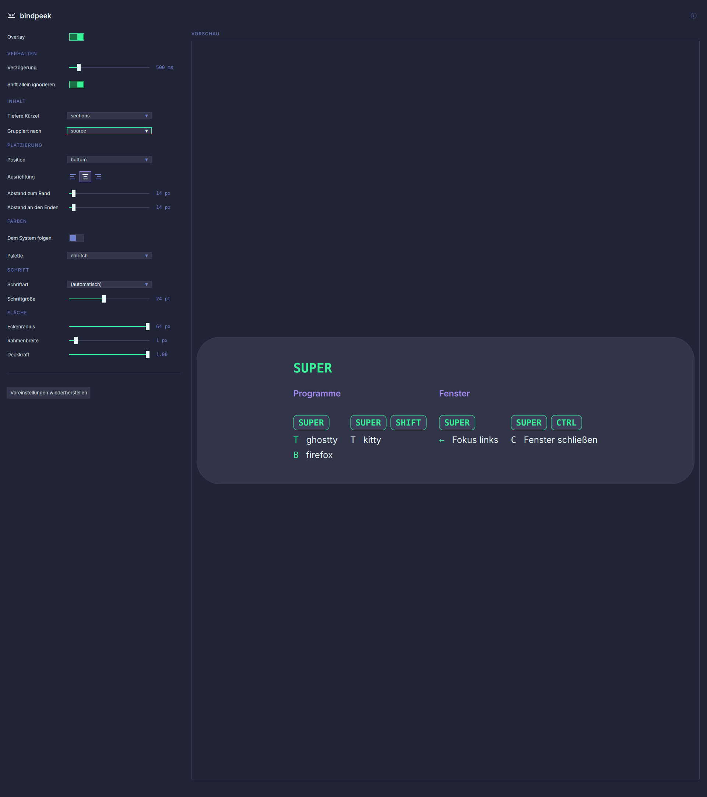

<!--
SPDX-FileCopyrightText: 2026 Maik-0000FF
SPDX-License-Identifier: GPL-3.0-or-later
-->

# Configuration

Everything is in one file, `~/.config/bindpeek/bindpeek.conf`. The settings
window writes it and the panel watches it, so a change is on screen at once and
there is never a second place where the same setting lives.

The file is written on the first start with a comment above every line, so it
can be edited without this page next to it. **Delete a line to fall back to its
default.** Anything unusable is reported rather than quietly corrected: the
program says which line it could not use and carries on with the default for it.



The preview on the right is not a picture of the panel, it is the panel, built
from the same files the overlay is built from. What a control does is therefore
visible before the file is written.

## The settings

| Key | Values | Default | What it does |
| --- | --- | --- | --- |
| `showDelayMs` | 0 to 5000 | `500` | How long a modifier has to be held before the panel appears. 0 shows it at once |
| `overlayEnabled` | `true`, `false` | `true` | Whether the panel is wanted at all. The tray writes this line, so the answer survives a logout |
| `position` | `center`, `left`, `right`, `top`, `bottom` | `bottom` | Where the panel sits. `center` floats in the middle |
| `marginPx` | 0 to 400 | `14` | Distance to that edge. Ignored for `center` |
| `edgeInsetPx` | 0 to 400 | `14` | How far a panel against an edge stops short of the two ends of it. 0 runs it corner to corner. Ignored for `center` |
| `alignment` | `start`, `center`, `end` | `center` | Where the content sits along the edge the panel spans |
| `disclosure` | `exact`, `inline`, `footer`, `sections` | `sections` | How shortcuts that need a further modifier are shown, see below |
| `arrangement` | `source`, `modifiers` | `source` | Which headings the list is cut into, see below |
| `ignoreLoneShift` | `true`, `false` | `true` | Whether a Shift held on its own is ignored. Shift alone is how capitals are typed, not how a shortcut is looked up |
| `theme` | one of fourteen palettes | `bindpeek` | The palette |
| `followSystemScheme` | `true`, `false` | `false` | Follow the desktop's light/dark setting |
| `themeLight` | a palette | `light` | Used when the desktop reports light |
| `themeDark` | a palette | `bindpeek` | Used when the desktop reports dark |
| `fontFamily` | a family name | empty | Empty picks the first installed from a built-in list |
| `fontSizePt` | 6 to 48 | `14` | The base size. Everything else on the panel is derived from it |
| `cornerRadiusPx` | 0 to 64 | `14` | The rounding of the panel |
| `borderWidthPx` | 0 to 16 | `1` | The frame of the panel |
| `opacity` | 0.0 to 1.0 | `0.90` | How solid the panel is |

`alignment` is named for the ends of an axis rather than for left and right,
because which axis it applies to follows from the position: along the top or
bottom the three words mean left, centre and right; along a side they mean top,
middle and bottom. In the `center` position nothing spans anything and the
setting has nothing to do.

`cornerRadiusPx` and `borderWidthPx` are about the panel as a shape. The keys
drawn inside it keep their own hairline and their own rounding, which follows
the font size: a key set to the same four pixels as the plate would be a box
with a letter in it.

The palettes, in the order the settings window offers them: `bindpeek`, `dark`,
`light`, `contrast`, `catppuccin-mocha`, `catppuccin-latte`, `nord`,
`gruvbox-dark`, `dracula`, `tokyo-night`, `rose-pine`, `solarized-light`,
`eldritch` and `kanagawa`.

## Disclosure: what a further modifier would reach

Hold one modifier and there are usually two kinds of shortcut: the ones that
fire right now, and the ones that need another key as well. `disclosure` decides
what happens to the second kind.

| Value | What you see |
| --- | --- |
| `exact` | Only what the held keys fire right now |
| `inline` | The rest in the same list, with the missing modifiers written in front of the key |
| `footer` | A line at the bottom saying which modifier leads to how many more |
| `sections` | Each further combination gets a block of its own, headed by its keys |

## Arrangement: which headings the list is cut into

A session hands its shortcuts out under headings of its own: the application
under KDE, the submap under Hyprland, the mode under sway. `arrangement`
decides whether the panel keeps them.

| Value | What you see |
| --- | --- |
| `source` | The headings the session gives, in the order it gives them |
| `modifiers` | One group per combination, nearest first: what fires on the next key, then what wants one more modifier, then two |

With `modifiers` a group is headed by the combination itself, and every row
under it then carries its key alone. Which way that heading is drawn follows
`disclosure`: with `sections` it is the key caps, drawn as keys, and with any
other word it is the combination written out. Only one of the two ever
appears, because both would say the same thing.

## Where the text in the panel comes from

Two different places, and knowing which is which tells you where to change
something.

**The headings** are the groups the session itself gives its shortcuts:

- **mango** has no grouping of its own, so a comment line of the form
  `# --- Name ---` in the configuration starts a group and everything below it
  belongs to that group. The text between the dashes is taken **exactly as it
  stands**, so anything in brackets there is in brackets on the panel. Every
  other comment line is a note and leaves the grouping alone.
- **Hyprland** groups by submap, a submap being a mode of its own and its binds
  working only while it is on.
- **sway** groups by mode, which is the same idea under another name: what is
  written inside `mode "resize" { … }` is headed by that mode. A block that is
  not a mode, a `bar` among them, changes nothing about the heading.
- **KDE Plasma** groups by the component the shortcut belongs to, under the
  name that component gives itself.

Anything that falls outside all of that, a mango bind written before the first
section comment, a Hyprland bind in no submap or a sway bind in no mode, is
collected under one heading at the end.

**The description**, the text on the right, is a different matter per session:

- **KDE Plasma** stores one and it is used as it is.
- **Hyprland** stores one only for a bind that was written to have one, and
  then it wins. Otherwise the text is worked out from the dispatcher and its
  argument.
- **mango** has nowhere to put one. A line is
  `bind=MODIFIERS,KEY,ACTION,PARAMS` and there is no field for a description, so
  the text is worked out from the action name alone.
- **sway** has nowhere either. A line is `bindsym KEYS COMMAND`, so the command
  is what there is: a word sway knows becomes a sentence for it, and anything
  else is shown as written.

Where the text is worked out rather than read, an action bindpeek does not know
is shown by its raw name together with its parameters. That is worth knowing,
because it is also how a dead line looks: a shortcut carried over from another
compositor whose action this one has never heard of appears with its bare
action name, while everything the program understands reads as plain language.

bindpeek never asks the compositor whether an action exists. It shows what the
configuration says, and a line that is in the file is on the panel whether or
not it does anything.

## Where the shortcuts are read from

Normally the session's own source, found by itself. Two options change that,
which is mostly useful for trying something out:

```bash
bindpeek --environment hyprland --source ./somefile.conf --list
```

`--environment` forces the session type instead of detecting it, and `--source`
reads that file instead of the one the session uses. Both work with `--list` as
well as with the panel.
